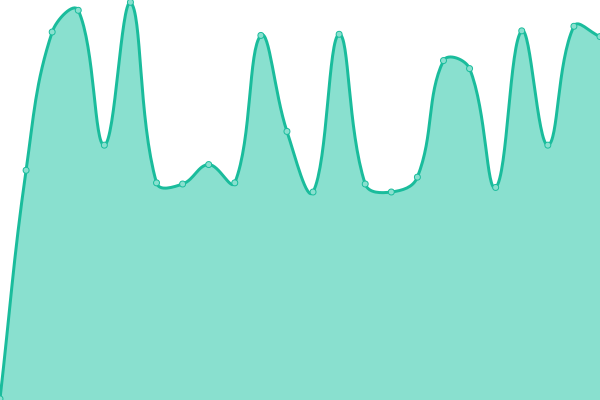

# [📈 Live Status](https://imneozz.github.io/majestic): <!--live status--> **🟥 Complete outage**

With [Upptime](https://upptime.js.org), you can get your own unlimited and free uptime monitor and status page, powered entirely by a GitHub repository. We use [Issues](https://github.com/imneozz/majestic/issues) as incident reports, [Actions](https://github.com/imneozz/majestic/actions) as uptime monitors, and [Pages](https://imneozz.github.io/majestic) for the status page.

<!--start: status pages-->
<!-- This summary is generated by Upptime (https://github.com/upptime/upptime) -->
<!-- Do not edit this manually, your changes will be overwritten -->
<!-- prettier-ignore -->
| URL | Status | History | Response Time | Uptime |
| --- | ------ | ------- | ------------- | ------ |
|  [API](https://majestic.discloud.app/shop) | 🟥 Down | [api.yml](https://github.com/imneozz/majestic/commits/HEAD/history/api.yml) | 

 1125ms
     
 | 

<a href="https://imneozz.github.io/majestic/history/api">18.68%</a>
    

|  [BACKEND](http://167.235.155.125) | 🟥 Down | [backend.yml](https://github.com/imneozz/majestic/commits/HEAD/history/backend.yml) | 

 246ms
     
 | 

<a href="https://imneozz.github.io/majestic/history/backend">40.25%</a>
    

|  [DISCORD BOT](http://167.235.155.125) | 🟥 Down | [discord-bot.yml](https://github.com/imneozz/majestic/commits/HEAD/history/discord-bot.yml) | 

 122ms
     
 | 

<a href="https://imneozz.github.io/majestic/history/discord-bot">40.26%</a>
    

<!--end: status pages-->

[**Visit our status website →**](https://imneozz.github.io/majestic)

## 📄 License

- Powered by: [Upptime](https://github.com/upptime/upptime)
- Code: [MIT](./LICENSE) © [Anand Chowdhary](https://anandchowdhary.com), supported by [Pabio](https://pabio.com)
- Data in the `./history` directory: [Open Database License](https://opendatacommons.org/licenses/odbl/1-0/)
